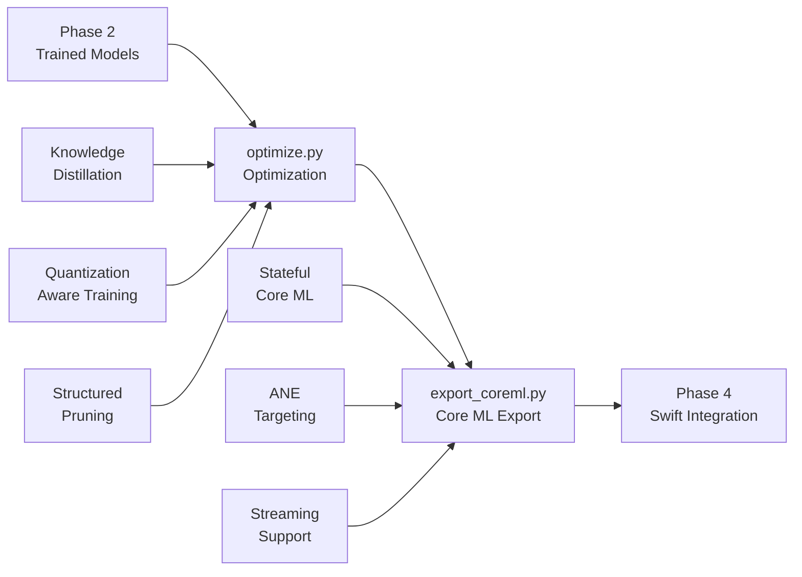

# Mamba-ASR Phase 3 Optimization Scripts

**Production-ready optimization and deployment pipeline for Apple Silicon speech recognition**

This directory contains Phase 3 optimization tools that transform trained Mamba speech recognition models into production-ready deployments optimized for Apple Neural Engine (ANE) and Core ML integration.

## 🎯 Overview

The scripts package bridges the gap between Phase 2 training and Phase 4 deployment by providing:

- **Model Optimization**: Knowledge distillation, quantization-aware training, and structured pruning
- **Core ML Export**: ANE-optimized model conversion for iOS/macOS deployment  
- **Production Pipeline**: End-to-end workflow with performance validation
- **Apple Silicon Focus**: Hardware-specific optimizations throughout

## 📊 Optimization Pipeline



## 🚀 Quick Start

### Basic Optimization Workflow

```bash
# 1. Knowledge distillation (teacher → student)
python scripts/optimize.py \
    --technique kd \
    --teacher models/large_mct.pth \
    --student models/compact_mct.pth \
    --epochs 3

# 2. Quantization-aware training
python scripts/optimize.py \
    --technique qat \
    --model models/compact_mct.pth \
    --precision int8 \
    --epochs 5

# 3. Export optimized model to Core ML
python scripts/export_coreml.py \
    --model models/optimized_mct.pth \
    --output MambaASR.mlpackage \
    --chunk_length 256
```

### Python API Usage

```python
from scripts import knowledge_distillation, export_to_coreml
from torch.utils.data import DataLoader

# Load your trained models and data
teacher_model = torch.load("large_mct.pth")
student_model = torch.load("compact_mct.pth")
train_loader = DataLoader(train_dataset, batch_size=16)
val_loader = DataLoader(val_dataset, batch_size=16)

# Knowledge distillation
optimized_model = knowledge_distillation(
    student_model=student_model,
    teacher_model=teacher_model,
    train_dataloader=train_loader,
    val_dataloader=val_loader,
    epochs=3,
    temperature=2.0,
    alpha=0.5
)

# Export to Core ML for deployment
export_to_coreml(
    pytorch_model=optimized_model,
    output_path="MambaASR.mlpackage",
    chunk_length=256
)
```

## 📁 Module Documentation

### `optimize.py` - Model Optimization Pipeline

**Purpose**: Implements three key optimization techniques for Apple Silicon deployment.

#### Knowledge Distillation
- **Goal**: Compress large, accurate models into compact, deployable models
- **Method**: Teacher-student learning with soft target guidance
- **Apple Silicon**: MPS-accelerated teacher inference and student training

```python
from scripts.optimize import knowledge_distillation, OptimizationConstants

# Configure distillation parameters
student_model = knowledge_distillation(
    student_model=compact_mct,
    teacher_model=large_mct,
    train_dataloader=train_loader,
    val_dataloader=val_loader,
    epochs=OptimizationConstants.DEFAULT_KD_EPOCHS,  # 3
    lr=OptimizationConstants.DEFAULT_KD_LEARNING_RATE,  # 1e-4
    temperature=OptimizationConstants.DEFAULT_TEMPERATURE,  # 2.0
    alpha=OptimizationConstants.DEFAULT_ALPHA  # 0.5
)
```

#### Quantization-Aware Training (QAT)
- **Goal**: Enable efficient INT8/INT4 inference on Apple Neural Engine
- **Method**: Simulated quantization during training for accuracy preservation
- **Apple Silicon**: ANE-compatible quantization schemes

```python
from scripts.optimize import quantization_aware_training

# Prepare model for ANE INT8 inference
qat_model = quantization_aware_training(
    model=trained_model,
    train_dataloader=train_loader,
    val_dataloader=val_loader,
    epochs=OptimizationConstants.DEFAULT_QAT_EPOCHS,  # 5
    lr=OptimizationConstants.DEFAULT_QAT_LEARNING_RATE  # 5e-5
)
```

#### Structured Pruning
- **Goal**: Reduce model size while maintaining regular tensor shapes for ANE
- **Method**: Iterative channel and filter pruning with fine-tuning
- **Apple Silicon**: Hardware-friendly pruning patterns

```python
from scripts.optimize import structured_pruning

# Compress model with hardware-aware pruning
pruned_model = structured_pruning(
    model=trained_model,
    train_dataloader=train_loader,
    val_dataloader=val_loader,
    pruning_amount=OptimizationConstants.DEFAULT_PRUNING_AMOUNT,  # 0.3
    num_iterations=OptimizationConstants.DEFAULT_PRUNING_ITERATIONS  # 3
)
```

### `export_coreml.py` - Core ML Export Pipeline

**Purpose**: Convert optimized PyTorch models to Core ML format with ANE targeting.

#### Stateful Core ML Export
- **Goal**: Enable efficient streaming inference with Mamba state management
- **Method**: Core ML StateType for recurrent state handling
- **Apple Silicon**: ANE-optimized operation mapping

```python
from scripts.export_coreml import export_to_coreml, CoreMLConstants

# Export with streaming support
export_to_coreml(
    pytorch_model=optimized_model,
    output_path="MambaASR.mlpackage",
    chunk_length=CoreMLConstants.DEFAULT_CHUNK_LENGTH,  # 256
    feature_dim=CoreMLConstants.DEFAULT_FEATURE_DIM,  # 80
    d_model=CoreMLConstants.DEFAULT_MODEL_DIM,  # 256
    d_state=CoreMLConstants.DEFAULT_STATE_DIM  # 16
)
```

## 🎯 Performance Targets

### Model Size Reduction
- **Target**: 50-80% reduction from baseline models
- **Method**: Combined optimization techniques
- **Validation**: Model size measurement and deployment testing

### Accuracy Preservation  
- **Target**: <5% WER degradation from full-precision models
- **Method**: Careful optimization with validation checkpoints
- **Validation**: LibriSpeech test set evaluation

### Apple Neural Engine Utilization
- **Target**: >90% operations running on ANE
- **Method**: ANE-compatible operation selection and tensor shapes
- **Validation**: Core ML performance analysis and Xcode profiling

### Inference Speed
- **Target**: <10ms latency for 10-second audio chunks
- **Method**: Optimized model architecture and efficient state management
- **Validation**: Real-time inference benchmarking

## 🔧 Configuration and Constants

### OptimizationConstants
```python
from scripts.optimize import OptimizationConstants

# Knowledge Distillation
OptimizationConstants.DEFAULT_KD_EPOCHS = 3
OptimizationConstants.DEFAULT_TEMPERATURE = 2.0
OptimizationConstants.DEFAULT_ALPHA = 0.5

# Quantization-Aware Training  
OptimizationConstants.DEFAULT_QAT_EPOCHS = 5
OptimizationConstants.INT8_PRECISION = 8
OptimizationConstants.INT4_PRECISION = 4

# Structured Pruning
OptimizationConstants.DEFAULT_PRUNING_AMOUNT = 0.3
OptimizationConstants.DEFAULT_PRUNING_ITERATIONS = 3

# Performance Targets
OptimizationConstants.TARGET_MODEL_SIZE_REDUCTION = 0.7  # 70%
OptimizationConstants.TARGET_WER_DEGRADATION = 0.05      # 5%
OptimizationConstants.TARGET_ANE_UTILIZATION = 0.9       # 90%
```

### CoreMLConstants
```python
from scripts.export_coreml import CoreMLConstants

# Model Configuration
CoreMLConstants.DEFAULT_CHUNK_LENGTH = 256
CoreMLConstants.DEFAULT_FEATURE_DIM = 80
CoreMLConstants.DEFAULT_MODEL_DIM = 256
CoreMLConstants.DEFAULT_STATE_DIM = 16

# Apple Neural Engine Optimization
CoreMLConstants.TARGET_ANE_UTILIZATION = 0.9
CoreMLConstants.MAX_INFERENCE_LATENCY = 0.01  # 10ms

# Deployment Targets
CoreMLConstants.MINIMUM_IOS_VERSION = "iOS16"
CoreMLConstants.MINIMUM_MACOS_VERSION = "macOS13"
```

## 📱 Deployment Workflow

### 1. Phase 2 → Phase 3 Transition
```bash
# Input: Trained models from Phase 2
ls models/
# mct_model.pth (from train_RNNT.py)
# conmamba_model.pth (from train_CTC.py)

# Choose optimization strategy based on deployment requirements
python scripts/optimize.py --technique kd --model models/mct_model.pth
```

### 2. Optimization Pipeline
```bash
# Sequential optimization (recommended)
python scripts/optimize.py --technique kd --model input.pth --output distilled.pth
python scripts/optimize.py --technique qat --model distilled.pth --output quantized.pth  
python scripts/optimize.py --technique prune --model quantized.pth --output final.pth

# OR single-step optimization
python scripts/optimize.py --technique kd --model input.pth --output optimized.pth
```

### 3. Core ML Export
```bash
# Export for iOS/macOS deployment
python scripts/export_coreml.py \
    --model optimized.pth \
    --output MambaASR.mlpackage \
    --chunk_length 256 \
    --validate_ane
```

### 4. Phase 3 → Phase 4 Transition
```bash
# Output: Ready for Swift integration
ls exports/
# MambaASR.mlpackage (Core ML model)
# performance_report.json (ANE validation)
# accuracy_metrics.json (WER evaluation)
```

## 🧪 Validation and Testing

### Performance Validation
```python
# Validate ANE utilization
from scripts.export_coreml import validate_ane_execution
ane_report = validate_ane_execution("MambaASR.mlpackage")
print(f"ANE utilization: {ane_report['ane_percentage']:.1%}")

# Measure inference latency
from scripts.benchmarks import benchmark_inference
latency_report = benchmark_inference("MambaASR.mlpackage")
print(f"Average latency: {latency_report['avg_latency']:.2f}ms")
```

### Accuracy Validation
```python
# Evaluate WER on LibriSpeech test set
from scripts.evaluate import evaluate_model_accuracy
wer_report = evaluate_model_accuracy(
    model_path="optimized.pth",
    test_manifest="librispeech_test.csv"
)
print(f"WER degradation: {wer_report['wer_degradation']:.1%}")
```

## 🔍 Troubleshooting

### Common Issues

#### 1. ANE Compatibility Issues
```bash
# Symptom: High CPU/GPU fallback rate
# Solution: Check operation compatibility
python scripts/export_coreml.py --model model.pth --validate_ops

# Alternative: Use CPU-friendly fallback
python scripts/export_coreml.py --model model.pth --allow_fallback
```

#### 2. Memory Pressure During Optimization
```bash
# Symptom: System slowdown or crashes
# Solution: Reduce batch size and enable gradient checkpointing
python scripts/optimize.py --batch_size 8 --gradient_checkpointing
```

#### 3. Accuracy Degradation
```bash
# Symptom: High WER after optimization
# Solution: Increase optimization epochs or reduce compression
python scripts/optimize.py --epochs 10 --pruning_amount 0.1
```

#### 4. Export Failures
```bash
# Symptom: Core ML conversion errors
# Solution: Enable verbose logging and fallback mode
python scripts/export_coreml.py --verbose --enable_fallback
```

### Performance Debugging

#### Enable Profiling
```python
# Profile optimization pipeline
import torch.profiler
with torch.profiler.profile(
    activities=[torch.profiler.ProfilerActivity.CPU, 
                torch.profiler.ProfilerActivity.CUDA],
    record_shapes=True
) as prof:
    optimized_model = knowledge_distillation(...)
```

#### Monitor Memory Usage
```python
# Track unified memory pressure
import psutil
process = psutil.Process()
memory_info = process.memory_info()
print(f"RSS: {memory_info.rss / 1024**3:.2f} GB")
```

## 🔗 Integration Points

### Input Sources
- **Phase 2 Models**: `train_CTC.py`, `train_RNNT.py` outputs
- **Datasets**: LibriSpeech via `datasets/librispeech_csv.py`
- **Architecture**: ConMambaCTC, MCTModel from `modules/`

### Output Targets
- **Phase 4 Integration**: Swift iOS/macOS applications
- **Core ML Models**: `.mlpackage` files for deployment
- **Performance Reports**: ANE utilization and latency analysis

### Validation Tools
- **Benchmarking**: `benchmarks/bench_mps.py` for performance verification
- **Metrics**: `utils/metrics.py` for accuracy evaluation
- **Profiling**: Xcode Instruments for ANE execution analysis

## 📚 References

- [Core ML Documentation](https://developer.apple.com/documentation/coreml)
- [Apple Neural Engine Programming Guide](https://developer.apple.com/machine-learning/)
- [Metal Performance Shaders](https://developer.apple.com/documentation/metalperformanceshaders)
- [Knowledge Distillation Paper](https://arxiv.org/abs/1503.02531)
- [Quantization-Aware Training](https://arxiv.org/abs/1712.05877)
- [Structured Pruning Methods](https://arxiv.org/abs/1608.08710)

---

**Next Steps**: Once models are optimized and exported, proceed to Phase 4 Swift application integration using the generated `.mlpackage` files.